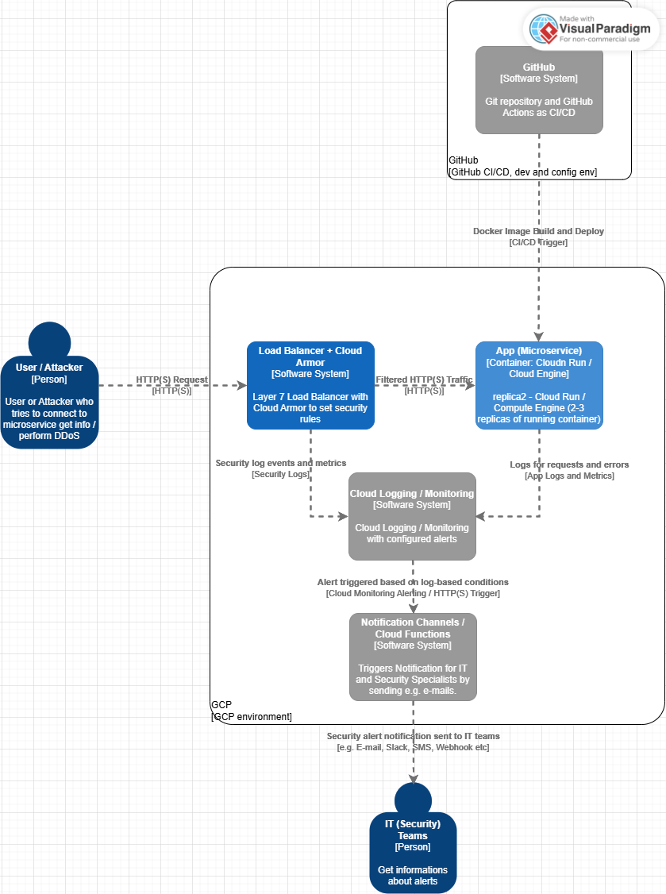
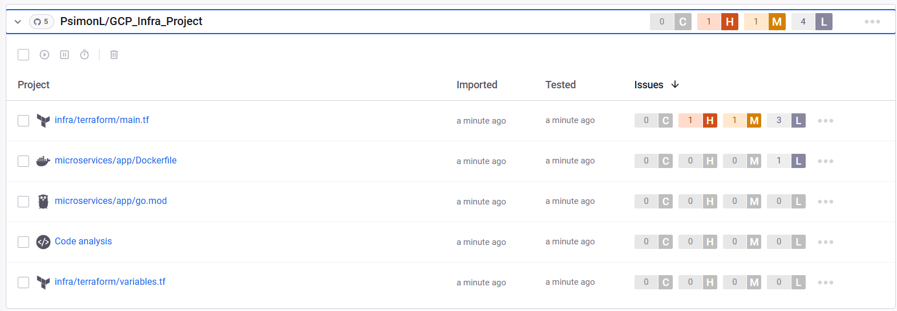
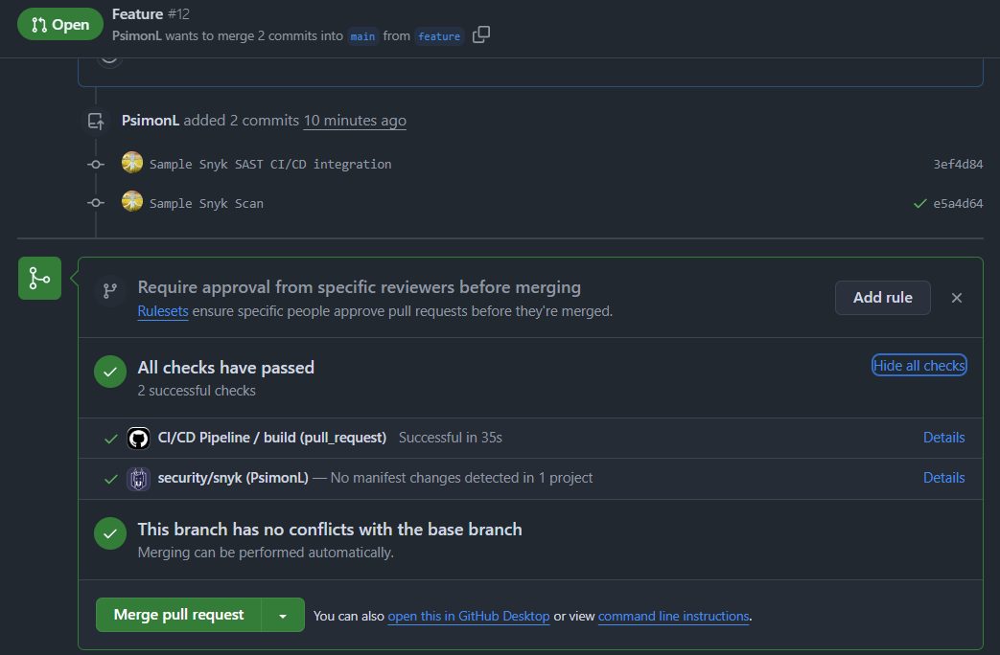
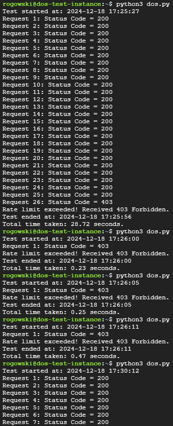
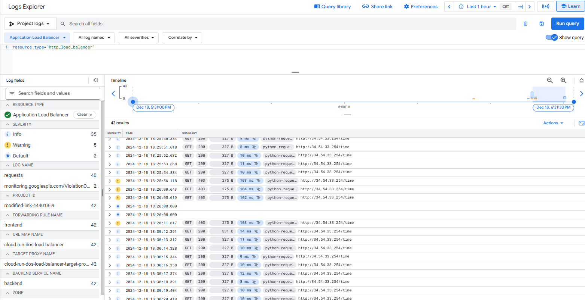
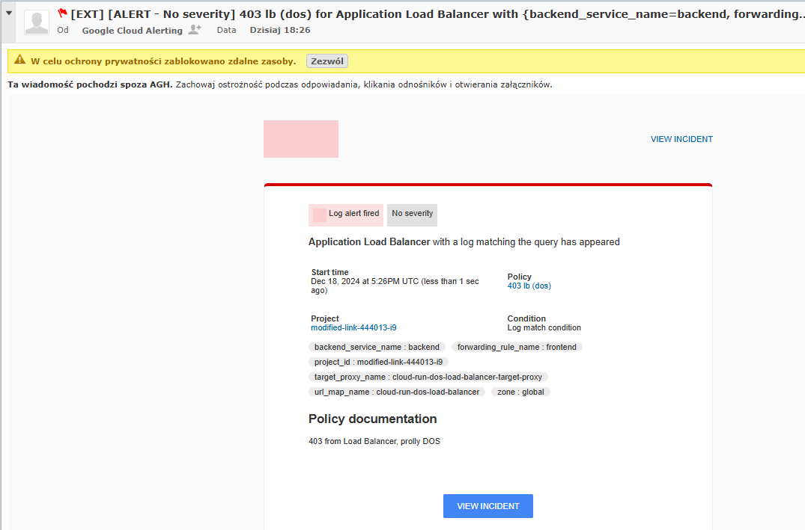
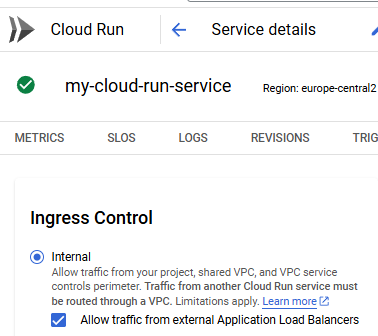

# GCP_Infra_Project
## Project Description
### Name:
Securing a Golang Application Against DoS ~~/DDoS~~ Attacks Using Google Cloud Armor and Automated Deployments with Terraform.

### Description:
The project automates the deployment of a Golang application and its infrastructure to Google Cloud Platform (GCP). The codebase, including the application source code and Terraform infrastructure configuration, is stored in GitHub. Deployment is triggered automatically upon changes to the repository, ensuring consistent and secure provisioning of the environment and application.

### Used GCP Services:
- **Google Cloud Armor**: Protection against DoS/DDoS attacks and defining access rules.
- **Cloud Load Balancer**: Traffic distribution and integration with Cloud Armor. 7th layer type load balancer (HTTP(S)).
- **Cloud Run**: Hosting the Golang application with serverless autoscaling.
- **Compute Engine**: Small virtual machine provisioned for testing DoS ~~/DDoS~~ scenarios.
- **Cloud Logging / Monitoring**: Providing visibility into app performance, security events, and detecting DoS/DDoS attempts.
- **Notification Channels / Cloud Functions**: Configured to send real-time, security alerts via email, SMS, webhooks, etc.

### Functionalities:
- **Golang Microservice**:
  + A lightweight Golang-based service designed for high performance.
- **Security**:
  + Cloud Load Balancer integrated with Google Cloud Armor for traffic control.
  + Cloud Armor rules:
    - Define IPs that can access the application.
    - Implement rate-limiting policies to mitigate DoS attacks.
- **CI/CD**:
  + **GitHub Actions pipeline** automates deployment:
    - Builds a Docker image of the application.
    - Deploys it to Cloud Run.
    - Provisions infrastructure (including Load Balancer and Cloud Armor) using Terraform.
- **Infrastructure as Code (IaC)**:
  + Terraform used for consistent and automated provisioning:
    - Cloud Run for the application.
    - Load Balancer and Cloud Armor rules for security.
    - Small Compute Engine instances for testing attacks.
  + Commands like `terraform init`, `terraform plan`, `terraform apply` and `terraform destroy` are executed automatically as part of the CI/CD pipeline.
- **Logging and Monitoring**:
  + Integrates with Cloud Logging to track unauthorized access attempts and abnormal request patterns.
- **Alerts**:
  + Notification Channels ~~or Cloud Functions~~ send alerts for suspicious activity, such as repeated requests from a single IP.
---

## Repo structure description
Good practice is to store code and configs separately, but in this case, "monorepo" is also appropriate choice. Project is
not big and focuses mainly on infrastructure side and GCP services.
---

## C4 model: C2 diagram - container diagram
- The C4 Model is a simple yet powerful approach for visualizing software architecture, focusing on four hierarchical levels: Context, Containers, Components, and Code. It helps communicate the structure and interactions of a system in a clear and structured way, suitable for both technical and non-technical audiences. More information can be found here: https://c4model.com/.
- Container diagram (C2 diagram) for this project:

---

## Sample Snyk scan 
- Unfortunately free versions of GitHub and Snyk only offer scanning and results at https://app.snyk.io/ Snyk web console.
But sample CI/CD config was provided to run SAST type scanning and visualize results at ```GCP_Infra_Project > Security > Code scanning alerts```.
- Sample scan from Snyk web console:

- Because of already merging and pulling current project to Snyk Web Console, automatic test will be run. And can be found at Web Console.
Follow **(Details)** link which can be seen at below screenshot:

- Sample scan report integrated with Github, based on provided [documentation](https://github.com/snyk/actions/tree/master/golang):

---

## Results
1. DoS attacker GCE instance perspective:
Script ```dos/dos.py``` must be run, to trigger sample script which will violate Cloud Armor policy ```google_compute_security_policy```,
connected with GCP Load Balancer with predefined backend and frontend.  
Sample output:


2. Log Explorer analysis:
Secondly, HTTP response status codes should be visible in Log Explorer - ```200```, and ```403``` after violating policy: 
```terraform
rate_limit_threshold {
    count        = 25
    interval_sec = 60
  }
```
Which means 25 reponses for 60 seconds, if exceeded user must wait until 60 seconds passed. Fresh new minute will allow next 25 connections and so on.


3. Log Explorer Notification Channel:
```google_monitoring_notification_channel``` was used to create notification channel to notify if 403 occurs on given e-mail address.
In my case it was AGH University of Science and Technology domain e-mail address:  


> In summary 13 resources should be allocated in the process of setting up whole infrastructure of this project.
---
## Remarks
- When Cloud Run is being set, it's incredible important to change that switch from ```All``` to ```Internal``` with checkbox ```"Allow traffic from external Application Load Balancers"```:


- Only type of DoS with regards to strictness of Cloud Armor policies was implemented. So concept was tested, cause DDoS is just scaled horizontally DoS (more GCE instances should be used, at least 3).

## Useful stuff and links:
- Automate Terraform with GitHub Actions: https://developer.hashicorp.com/terraform/tutorials/automation/github-actions
- Automate Deployment to GCP: https://www.youtube.com/watch?v=kZYsoav104w&ab_channel=COMMAND
- Terraform guides: https://registry.terraform.io/providers/hashicorp/google/latest/docs/guides/getting_started#linking-gcp-resources
- Loud Balancing: https://cloud.google.com/load-balancing?hl=pl
- https://cloud.google.com/load-balancing/docs/application-load-balancer
- GCP Cloud Armor: https://yassinekader.medium.com/how-to-secure-cloud-run-with-cloud-armor-a-comprehensive-guide-c503b6df011
- Loud Balancer + Cloud Armor: https://cloud.google.com/load-balancing/docs/https/setting-up-https-serverless#gcloud_1
- https://cloud.google.com/load-balancing/docs/https/setting-up-https-serverless#ssl_certificate_resource
- https://cloud.google.com/load-balancing/docs/https/setting-up-reg-ext-https-serverless
- GCP IP Addressing: https://cloud.google.com/compute/docs/ip-addresses#externaladdresses
- https://cloud.google.com/vpc/network-pricing#ipaddress
- Generate Terraform code from cloud (GCP) infrastructure configs: https://medium.com/@Matt-Jns/generate-the-terraform-code-for-google-cloud-resources-92e751e6cdd2
- https://medium.com/@nanditasahu031/terraformer-generate-terraform-files-from-existing-infrastructure-5d709fedd2b9
- Github Manual Workflow notes: https://docs.github.com/en/actions/managing-workflow-runs-and-deployments/managing-workflow-runs/manually-running-a-workflow
- GCP Terraformer: https://github.com/GoogleCloudPlatform/terraformer?tab=readme-ov-file
- Snyk-Github: https://github.com/snyk/actions
- https://docs.snyk.io/scan-with-snyk/pull-requests/pull-request-checks
---

[//]: # (![ssss]&#40;https://media.licdn.com/dms/image/v2/D4E22AQHS-eSy_8RJXw/feedshare-shrink_1280/feedshare-shrink_1280/0/1733581957058?e=1736380800&v=beta&t=EaayECsrz5lgZcnjxLM4G7ON-9AjCbgDmsjdY9APteQ&#41;)
